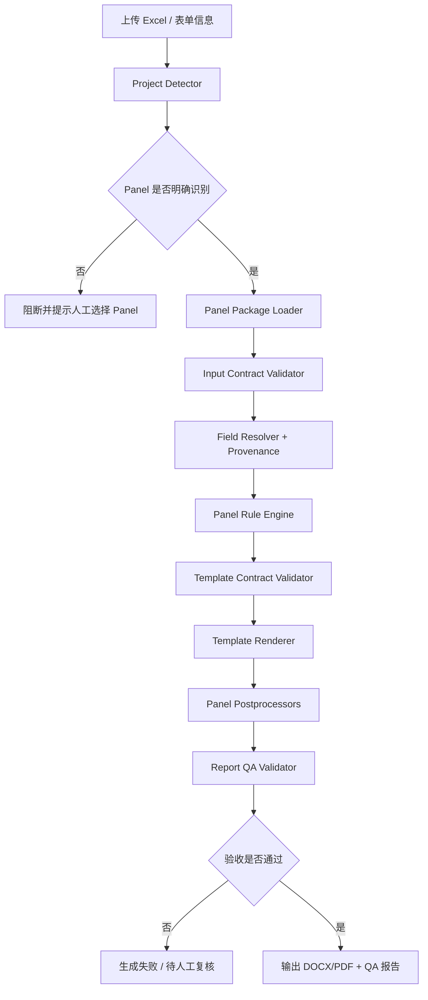

# 多 Panel / 多模板自动化报告平台架构优化 PRD

版本：v0.1
日期：2026-05-17
状态：Draft
作者：Codex

## 1. 背景

当前系统已经能基于 Excel、临床信息表单、模板 DOCX 和知识库生成结直肠癌 Panel 报告。近期围绕 CRC 358 + MSI 模板做了大量修复，包括字段补齐、TMB/MSI 文案、NCCN 表、药物解析、目录页码、表格字体颜色、空项目符号等。

这些问题暴露出一个更大的架构风险：当前实现仍然以“一个主模板 + 一套 CRC 专用增强逻辑 + 大量后处理补丁”为中心。后续如果继续增加肺癌、乳腺癌、甲基化、融合、CNV、不同客户版式等 Panel 项目，继续在现有链路里堆条件判断，会导致输出结果更不稳定，测试成本也会快速上升。

本 PRD 的目标是定义下一阶段的产品与技术架构方向：把系统从“单模板报告生成器”升级为“多 Panel / 多模板报告生产平台”。

## 2. 当前问题

### 2.1 生成逻辑与模板强耦合

当前大量逻辑依赖 DOCX 中固定文本、固定表头、固定段落位置。例如 2.1 变异表、TMB/MSI 表、致患者信、目录页码、空白页清理等，都由渲染后处理代码按文档内容扫描修复。一旦模板文字或结构变化，代码可能失效。

### 2.2 渲染器职责过重

`reportgen/core/template_renderer.py` 已承担模板渲染、内容补丁、表格样式修复、目录刷新、页眉页脚、签名、尾页清理等职责。它已经接近“万能后处理器”，不利于多模板扩展，也不利于定位问题。

### 2.3 Panel 规则没有产品化边界

CRC 358/301 的增强逻辑目前集中在 `template_bridge_358.py` 和相关映射/校验代码中。后续新增 Panel 时，缺少统一的规则包结构，例如：

- 这个 Panel 需要哪些 Excel sheet。
- 这个 Panel 需要哪些单值字段。
- 这个 Panel 使用哪些知识库。
- 这个 Panel 有哪些报告章节。
- 哪些表格需要后处理。
- 哪些输出可以为空，哪些必须阻断。

### 2.4 项目类型识别失败时风险过高

系统支持项目类型检测，但未知项目或未注册项目会进入降级路径。生产上这很危险，因为系统可能生成一份“看起来成功、实际缺失关键增强字段”的报告。

### 2.5 缺少报告级验收闭环

现有测试主要覆盖局部函数和部分回归点，但客户实际关心的是整份 DOCX/PDF 是否符合正确报告。缺少按 Panel 维护的 golden case，导致每次修复容易出现“修好 A、破坏 B”。

## 3. 产品目标

### 3.1 主要目标

1. 支持多个 Panel 项目以独立配置包形式接入，不需要改动主流程。
2. 支持同一个 Panel 下多个模板版本，例如标准版、客户定制版、院内版。
3. 每个 Panel 明确声明输入字段、模板变量、知识库、规则、后处理器和验收用例。
4. 报告生成过程可追踪，能解释关键字段来自 Excel、表单、患者库、文件名还是计算逻辑。
5. 生成前做契约校验，生成后做结构、文本、样式和截图级验收。
6. 未识别项目、模板契约不满足、关键字段缺失时，不再静默生成错误报告。

### 3.2 非目标

1. 本阶段不重写整个报告系统。
2. 本阶段不要求把所有 DOCX 模板迁移到 HTML/PDF。
3. 本阶段不直接建设完整 LIMS 系统。
4. 本阶段不把所有医学知识规则自动化维护，仍允许人工审核后进入知识库。

## 4. 目标用户

1. 报告生产人员：上传 Excel、补充临床信息、选择或确认项目类型、生成报告。
2. 测试人员：对照正确报告做回归测试，确认每个修复点是否完成。
3. 模板维护人员：新增或修改 DOCX 模板，维护模板变量和版式约束。
4. 规则维护人员：维护 Panel 字段映射、药物规则、指南文本、知识库版本。
5. 开发人员：接入新 Panel，扩展规则插件和后处理器。

## 5. 核心方案：Panel Package 化

新增统一的 Panel Package 概念。每个 Panel 是一个独立目录，包含配置、模板、规则、后处理器声明、测试样例和验收标准。

建议目录结构：

```text
panels/
  crc_358_msi/
    panel.yaml
    mappings.yaml
    templates/
      standard_v1.docx
      customer_a_v1.docx
    rules/
      variants.yaml
      drugs.yaml
      biomarkers.yaml
      report_text.yaml
    processors.yaml
    golden_cases/
      case_001/
        input.xlsx
        clinical_info.json
        expected_contract.yaml
        expected_text.yaml
        expected_styles.yaml
```

主流程只读取 `panel.yaml`，根据声明动态加载该 Panel 的字段映射、规则、模板和处理器。

接入新 Panel 时，采用**数据驱动的 template-fit 分析法**：对每个候选 family 的报告语料，量化其与已有 golden template（如 CRC358）的兼容度，据此决定是直接复用骨架、扩展若干章节，还是为该 family 重新选择 golden base。算法、阈值与输出格式见 [`template_fit_methodology.md`](template_fit_methodology.md)；接入流程里的具体步骤见 [`onboarding_new_panel.md`](onboarding_new_panel.md) 的 Step 0.5。

## 6. 目标架构



## 7. 功能需求

### P0：Panel 注册与选择

系统必须支持通过配置注册 Panel。

每个 Panel 至少包含：

- `panel_id`
- `display_name`
- `aliases`
- `project_detector_rules`
- `default_template`
- `supported_templates`
- `required_input_tables`
- `required_single_fields`
- `enhancer`
- `postprocessors`
- `golden_cases`

当项目类型检测置信度低于阈值时，系统必须阻断自动生成，并要求用户手动选择 Panel。

当用户手动选择 Panel 时，系统必须以用户选择为准，但仍执行输入契约校验。

### P0：输入契约校验

每个 Panel 必须声明输入 Excel 的最小要求：

- 必需 sheet。
- 可选 sheet。
- 必需列。
- 可选列。
- 单值字段来源。
- 字段格式要求。
- 是否允许默认值。

生成前必须输出校验结果：

- `PASS`：可自动生成。
- `WARN`：可生成，但报告中记录警告。
- `FAIL`：阻断生成。

示例：

```yaml
input_contract:
  required_tables:
    - Variations
  required_single_fields:
    - sample_id
    - patient_name
    - report_date
  biomarkers:
    tmb_value:
      required: false
      source_priority: [excel, form, patient_db]
    msi_status:
      required: false
      allowed_values: [MSS, MSI-L, MSI-H, 未检测]
```

### P0：字段来源追踪

系统必须记录每个关键字段的最终值和来源。

字段来源优先级建议统一为：

1. 用户表单显式输入。
2. Excel 解析结果。
3. 患者信息库。
4. 文件名解析。
5. Panel 规则计算。
6. 默认值。

输出必须包含 `field_provenance.json`：

```json
{
  "sample_id": {"value": "MASKED", "source": "filename", "confidence": 1.0},
  "msi_status": {"value": "MSS", "source": "excel", "confidence": 1.0},
  "project_type": {"value": "crc_358_msi", "source": "user_selected", "confidence": 1.0}
}
```

注意：持久化或日志输出时必须脱敏患者隐私字段。

### P0：Panel 规则引擎

新增统一的 Panel Rule Engine。它不直接关心 DOCX 模板，只负责把输入数据转换成标准报告数据模型。

每个 Panel 可定义：

- 变异筛选规则。
- 变异分类规则。
- 药物推荐规则。
- 免疫治疗规则。
- NCCN/CSCO 指南表规则。
- 固定展示基因列表。
- 文案模板。
- 参考文献模板。

输出统一为 `ReportModel`：

```text
ReportModel
  metadata
  patient
  sample
  project
  biomarkers
  variants
  drugs
  immune_findings
  guideline_tables
  interpretation_sections
  appendix_tables
```

### P0：模板契约

每个模板必须有模板契约文件，用于声明：

- 必需变量。
- 必需循环表。
- 必需章节锚点。
- 必需表格结构。
- 表格列名与语义。
- 是否允许缺失。

生成前必须校验模板契约，缺失关键变量或表结构不匹配时阻断。

示例：

```yaml
template_contract:
  required_variables:
    - patient_name
    - sample_id
    - report_date
    - tmb_summary
    - msi_summary
  required_tables:
    variant_detail_table:
      columns: 9
      headers:
        - 基因名称
        - 转录本号
        - 染色体
        - 外显子
        - 位点
        - 突变类型
        - 频率(%)
        - 潜在获益靶向药物
        - 可能耐药或慎重药物
```

### P0：后处理器插件化

禁止继续把所有模板后处理堆进一个大文件。新增 Processor 插件机制。

推荐处理器类型：

- `CoverProcessor`
- `PatientInfoTableProcessor`
- `VariantSummaryTableProcessor`
- `VariantDetailTableProcessor`
- `BiomarkerTableProcessor`
- `TocProcessor`
- `BulletListProcessor`
- `SignatureProcessor`
- `FooterProcessor`
- `BlankPageCleanupProcessor`

每个处理器必须声明：

- 适用 Panel。
- 适用模板。
- 输入条件。
- 输出效果。
- 是否可失败。
- 对应测试。

处理器必须幂等：同一份 DOCX 重复执行，不应产生重复内容或破坏格式。

### P0：报告级 QA

每次生成必须同时输出 QA 报告。

QA 报告至少包括：

- 项目类型识别结果。
- 模板契约校验结果。
- 输入字段校验结果。
- 关键字段来源。
- 变异数量统计。
- 药物数量统计。
- TMB/MSI 结果。
- 目录页码是否存在。
- 是否存在空项目符号。
- 是否存在未替换占位符。
- 是否存在空白页。
- 是否存在关键表格列数错误。

QA 结果分级：

- `PASS`：可交付。
- `WARN`：可人工复核后交付。
- `FAIL`：不允许交付。

### P1：Golden Case 回归

每个 Panel 至少维护 1 个 golden case。客户反馈较多的 Panel 至少维护 3 个：

- 低 TMB / MSS。
- 高 TMB / MSI-H。
- 无靶向药或无关键变异。

Golden case 校验维度：

- 文本快照。
- 表格结构。
- 关键字段值。
- 样式属性。
- PDF 渲染页截图。
- 目录页码。

CI 或本地命令支持：

```bash
reportgen qa run --panel crc_358_msi
reportgen qa run --panel all
```

### P1：模板版本管理

每个模板必须有版本号和变更记录。

模板版本变更后必须重新跑对应 golden case。未通过时不允许设置为默认模板。

模板元数据示例：

```yaml
template:
  id: crc_358_msi_standard_v1
  file: templates/standard_v1.docx
  version: 1.0.0
  compatible_panel_versions: [">=1.0,<2.0"]
  owner: report-team
  status: active
```

### P1：Web 端多 Panel 工作流

报告生成页需要支持：

1. 上传 Excel 后自动检测 Panel。
2. 展示检测置信度和命中依据。
3. 置信度不足时允许人工选择 Panel。
4. 根据 Panel 动态加载临床信息表单。
5. 展示输入契约校验结果。
6. 展示字段来源预览。
7. 生成完成后展示 QA 报告。
8. `FAIL` 时禁止下载正式报告，可下载调试包。

### P2：Panel 开发向导

提供新 Panel 接入脚手架：

```bash
reportgen panel init lung_520
reportgen panel validate lung_520
reportgen panel test lung_520
```

脚手架生成：

- panel 配置。
- mapping 配置。
- 模板契约模板。
- 规则文件模板。
- 空 golden case 目录。
- 单元测试占位文件。

## 8. 非功能需求

### 稳定性

- 同一输入、同一 Panel、同一模板版本必须生成确定性结果。
- 后处理器必须幂等。
- 未识别 Panel 不得静默生成正式报告。

### 可观测性

- 每次生成必须有唯一 `generation_id`。
- 日志必须记录每个阶段耗时。
- QA 报告必须能定位失败阶段。

### 数据安全

- 不得提交真实患者数据到 Git。
- golden case 使用脱敏样本。
- 日志和 QA 报告默认脱敏姓名、样本号、病理号等字段。

### 可测试性

- 每个 Panel 插件必须有单元测试。
- 每个模板必须有契约测试。
- 每个生产 Panel 必须有至少一个端到端 golden case。

## 9. 推荐技术拆分

当前模块建议逐步拆分为：

```text
reportgen/
  core/
    pipeline.py
    report_model.py
    field_resolver.py
    provenance.py
    qa_validator.py
  panels/
    registry.py
    loader.py
    base.py
    crc_358_msi/
      enhancer.py
      rules.py
      processors.py
  rendering/
    renderer.py
    contract.py
    processors/
      base.py
      toc.py
      bullets.py
      tables.py
      signature.py
```

Web 后端只调用稳定接口：

```python
pipeline.generate(
    excel_path=...,
    clinical_info=...,
    panel_id=...,
    template_id=...,
)
```

返回：

```python
GenerateResult(
    status="PASS|WARN|FAIL",
    docx_path=...,
    pdf_path=...,
    qa_report_path=...,
    field_provenance_path=...,
)
```

## 10. 里程碑

### M1：稳定当前 CRC 358 / 301

目标：不改变产品体验，先把当前链路变得可观测、可验收。

范围：

- 增加 `generation_id`。
- 输出 QA 报告。
- 输出字段来源。
- 未识别 `crc_358`/`crc_301` 时阻断或 alias 明确化。
- 抽出 `BulletListProcessor`、`VariantTableProcessor`、`BiomarkerTableProcessor`。
- 建立 CRC golden case。

验收：

- CRC golden case 一键生成并通过。
- 不再出现空项目符号、错误 4 列表、缺目录页码、关键字段空值但仍成功的问题。

### M2：Panel Package 框架

目标：允许新增 Panel 不改主流程。

范围：

- `panels/` 目录结构。
- `panel.yaml` 加载。
- Panel registry。
- 输入契约校验。
- 模板契约校验。
- 后处理器注册机制。

验收：

- CRC 358 迁移为第一个 Panel Package。
- CRC 301 复用 CRC 规则但有独立配置。
- 未注册 Panel 不能生成正式报告。

### M3：新增第二个 Panel 试点

目标：验证架构是否真的支持多 Panel。

范围：

- 选择一个后续真实项目作为试点，例如肺癌或甲基化项目。
- 新建 Panel Package。
- 接入专属模板。
- 建立至少一个 golden case。

验收：

- 新 Panel 不修改 CRC 业务代码。
- 新 Panel 生成失败时能准确给出契约或规则错误。

### M4：Web 管理能力

目标：让运营和测试能在网页中管理多 Panel。

范围：

- Panel 列表页。
- 模板版本页。
- 生成 QA 报告页。
- Golden case 运行入口。
- 配置编辑和变更历史。

验收：

- 测试人员可在网页上查看每次生成为什么 PASS/WARN/FAIL。
- 模板升级可追踪、可回滚。

## 11. 验收指标

1. 新增一个标准 Panel 的开发工作量下降到 2-5 天。
2. 每次报告生成都有 QA 报告，失败原因可定位到具体阶段。
3. 生产报告中未替换占位符数量为 0。
4. 关键字段来源可追踪覆盖率达到 100%。
5. 每个上线 Panel 至少有 1 个 golden case。
6. 已上线 Panel 的回归测试可一键运行。
7. 同一输入重复生成 DOCX 文本和关键样式差异为 0。

## 12. 风险与应对

### 风险 1：DOCX 模板天然难以结构化

应对：通过模板契约和处理器锚点约束模板结构。模板维护人员修改模板后必须跑契约测试。

### 风险 2：历史补丁迁移成本高

应对：不要一次性重写。先把当前后处理函数按职责包装成 Processor，再逐步清理内部实现。

### 风险 3：知识库和医学规则版本不清

应对：Panel Package 中记录知识库版本和规则版本，生成报告时写入 QA metadata。

### 风险 4：测试样本涉及隐私

应对：golden case 必须脱敏；真实客户样本只放本地 storage，不进 Git。

## 13. 待确认问题

1. 后续最优先接入的第二个 Panel 是哪个？
2. 是否允许不同客户使用同一 Panel 的不同模板版本？
3. QA `WARN` 状态是否允许下载正式报告，还是必须人工确认后才允许？
4. Golden case 是否可以使用完全脱敏后的真实报告作为基准？
5. 模板维护是开发负责，还是报告团队通过后台上传？
6. Web 端是否需要支持批量报告按 Panel 自动分组生成？

## 14. 建议的下一步

优先做 M1。原因是当前 CRC 项目已经有真实反馈和正确报告，可以作为架构改造的基准样本。先把 CRC 358 固化成可观测、可测试的流水线，再把这套能力抽象成 Panel Package，否则新 Panel 接入时会把当前问题复制一遍。
